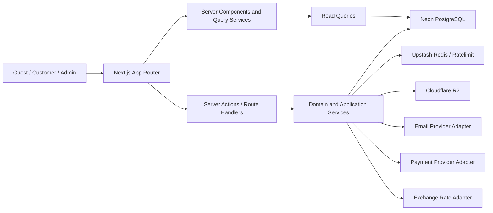
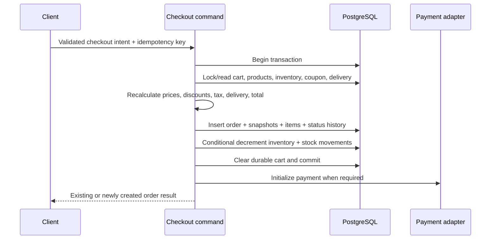

# White Shop — համակարգի architecture

**Architecture.** Feature-based modular monolith
**Product scope.** Size C
**Կարգավիճակ.** Approved for implementation — 2026-07-18
**Վերջին թարմացում.** 2026-07-18

## 1. Architecture drivers

- Storefront, customer և admin surfaces-ը կիսում են նույն catalog/order/auth domain-ը։
- Checkout, stock և money flows-ը պահանջում են transaction consistency և մեկ source of truth։
- SEO էջերը շահում են Server Components/streaming/caching-ից։
- External providers-ը (payment, email, R2, rates, Redis) պետք է փոխարինելի լինեն առանց domain rewrite-ի։
- Մեծ feature count-ը պահանջում է module boundaries, բայց առանձին services-ի operational cost-ը դեռ հիմնավորված չէ։

## 2. Բարձր մակարդակի համակարգ



## 3. Runtime և responsibility boundaries

### Presentation

- `src/app` routes/layouts/loading/error/not-found boundaries
- Server Components default; client components միայն browser interaction-ի համար
- Visible copy միայն locale dictionaries կամ translated database content-ից
- Presentation-ը չի հաշվարկում authoritative totals, permissions կամ stock changes

### Feature/application

- Յուրաքանչյուր feature ունի commands, queries, schemas, policies և public API
- Command handler-ը orchestrate է անում validation → authorization → transaction/provider → cache invalidation → audit/result
- Cross-feature coordination-ը անցնում է exported application API-ով, ոչ internal deep import-ով

### Domain

- Pure money, discount, coupon, delivery, stock, order state և permission rules
- Framework/UI/provider imports չկան pure domain modules-ում
- Invariants-ը testable են առանց Next.js runtime-ի

### Infrastructure

- Drizzle repositories/queries, Auth.js adapter/config, Redis, R2, email, payment, exchange-rate և observability adapters
- External error-ները map են արվում stable application errors-ի
- Secrets-ը միայն server-only modules-ում են

## 4. Առաջարկվող repository կառուցվածք

```text
src/
  app/
    [locale]/
      (storefront)/
        page.tsx
        products/
        about/
        contact/
        blog/
        policies/
      (auth)/
        login/
        register/
        forgot-password/
        reset-password/
        verify-email/
      profile/
      admin/
    api/
      auth/
      uploads/
      webhooks/
      exports/
    sitemap.ts
    robots.ts
  components/
    ui/
    layout/
    feedback/
  features/
    auth/
    users/
    products/
    categories/
    inventory/
    cart/
    checkout/
    orders/
    payments/
    promotions/
    reviews/
    wishlist/
    delivery/
    hero/
    blog/
    contact/
    analytics/
    settings/
    media/
  db/
    schema/
    migrations/
    queries/
    seed/
    client.ts
  lib/
    auth/
    email/
    money/
    i18n/
    permissions/
    r2/
    redis/
    security/
    validation/
    observability/
  locales/
    hy/
    en/
    ru/
  config/
  types/
  hooks/
tests/
  integration/
  e2e/
docs/
```

Canonical persistence model-ը 25 PostgreSQL table է։ UI copy-ն locale JSON files-ում է, իսկ admin-managed translations-ը entity table-ների validated `translations JSONB` դաշտերում։ Exact inventory-ը՝ [`03-DATA-MODEL.md`](./03-DATA-MODEL.md)։

Յուրաքանչյուր `features/<name>/` module-ը կարող է ունենալ՝

```text
index.ts              # արտաքին public API
domain/               # pure rules/types
application/          # commands/queries/use-case orchestration
infrastructure/       # Drizzle/provider implementations
ui/                   # feature-owned components
schemas/              # transport/form/search validation
```

Պարզ CRUD feature-ի համար դատարկ layers չեն ստեղծվում. structure-ը proportional է իրական boundary-ին։

## 5. Dependency rules

```text
app / shared UI
       ↓
feature public APIs
       ↓
application → domain
       ↓          ↑
infrastructure adapters
```

- `domain` չի import անում Next.js, React, Drizzle կամ provider SDK։
- `components/ui` չի import անում feature modules։
- Feature deep imports արգելվում են; cross-feature import-ը միայն `features/<x>/index.ts`-ից։
- Client component-ը չի import անում server-only module, database schema/client կամ secret-bearing config։
- Query և command modules-ը բաժանվում են, որպեսզի reads-ը cacheable լինեն, mutations-ը՝ auditable։

## 6. Rendering և data fetching strategy

| Surface | Default | Cache behavior |
|---|---|---|
| Home/catalog/product/blog | Server Components | Tagged revalidation, locale/currency-aware derived display |
| Search/filter/pagination | URL search params → server query | Shareable URL, deterministic parsing |
| Cart | Server authoritative + small client interaction island | No public cache; refresh after mutation |
| Checkout | Dynamic server flow | No shared cache; idempotent mutation |
| Profile/admin | Authenticated dynamic RSC | User/role scoped, no public cache |
| Admin interactive tables | RSC initial data + optional TanStack Query | Server pagination/filter; explicit invalidation |

`router.refresh()`/tag invalidation-ը կիրառվում են authoritative mutation-ից հետո։ Optimistic UI կիրառվում է միայն rollback-safe գործողությունների համար, օրինակ wishlist toggle, ոչ checkout/order/stock mutation-ի համար։

## 7. Critical flows

### 7.1 Query flow

```text
Request → locale/search-param validation → query service → PostgreSQL/cache
→ permission-aware DTO → Server Component → streamed HTML
```

### 7.2 Mutation flow

```text
Form/client intent → CSRF/same-origin boundary → Zod validation
→ session + permission → application command → DB transaction/provider
→ audit/outbox → cache invalidation → typed result → UI feedback
```

### 7.3 Checkout transaction



Եթե payment provider-ը պահանջում է external call մինչև finalization, ընտրված adapter-ի protocol-ը պետք է ADR-ով որոշի pending order/outbox/compensation behavior-ը։ DB transaction-ի ընթացքում slow external network call պահելը default չէ։

### 7.4 Guest cart merge

1. Guest cart-ը ունի random opaque token secure cookie-ում, items-ը durable table-ում։
2. Login-ից հետո transaction-ը բեռնում է guest և customer carts-ը։
3. Same purchasable item quantities-ը merge են լինում և clamp/reject են արվում current stock policy-ով։
4. Customer cart-ը դառնում է canonical, guest token-ը invalid է դառնում։
5. Merge-ը idempotent է և audit/telemetry event ունի։

### 7.5 Upload lifecycle

1. Authorized client-ը խնդրում է upload intent։
2. Server-ը validate է անում purpose, MIME, size և ownership, ստեղծում unique object key/pending media record։
3. Client-ը upload է անում presigned URL-ով։
4. Server finalize-ը ստուգում է object metadata-ն և կապում է media asset-ը entity-ին transaction-ում։
5. Replaced object-ը cleanup queue/mark է ստանում միայն DB commit-ից հետո։

## 8. Cache architecture

- **Next.js cache.** Public catalog/hero/blog read models՝ locale-aware tags-ով։
- **Redis ephemeral/cache.** Exchange rates, analytics aggregates, selected hot queries, product view counters և hashed verification/reset tokens։
- **Invalidation.** Product/category/hero/blog/settings mutation-ը invalid է դարձնում կոնկրետ Next tags և namespaced Redis keys։
- **No durable commerce authority.** Cache miss կամ Redis outage-ը չի կորցնում cart/order/stock տվյալները։ Verification/reset tokens-ը reissuable ephemeral state են։
- **Key shape.** Environment + feature + version + entity/query dimensions։ User PII-ն key-ում չի գրվում։

## 9. Provider abstractions

| Boundary | Minimum contract |
|---|---|
| Payment | `createPayment`, `verifyCallback`, `getStatus`, optional `refund` |
| Email | templated `send` with provider message ID and retry-safe key |
| Object storage | presign upload, head object, delete object, public URL builder |
| Exchange rate | fetch base-relative rates with effective timestamp/source |
| Observability | structured log, capture error, metric/timing |

Provider payloads/types չեն արտահոսում domain/storefront DTO-ների մեջ։

## 10. Failure և consistency model

- DB commit-ը հաջող, email-ը ձախողված լինելու դեպքում order-ը չի rollback լինում; event-ը retryable է։
- Duplicate checkout request-ը վերադարձնում է նույն order-ը ըստ idempotency key/user/cart scope-ի։
- Duplicate payment webhook-ը idempotent է provider event ID unique constraint-ով։
- Stock conflict-ը տալիս է recoverable conflict error և updated availability։
- Cache invalidation failure-ը log/metric է և retryable է; DB state-ը մնում է canonical։
- R2 cleanup failure-ը orphan cleanup job/report-ով վերականգնելի է։

## 11. Deployment topology

Առաջարկվող logical topology՝

```text
Edge/CDN/WAF
    ↓
Next.js Node runtime (same region family as database when possible)
    ├── Neon PostgreSQL
    ├── Upstash Redis
    ├── Cloudflare R2
    ├── Email provider
    └── Payment/rate providers
```

Development, preview/staging և production environments-ը ունեն առանձին secrets և տվյալների անվտանգ isolation։ Production migration-ը կատարվում է forward migration + backup/restore plan-ով, ոչ runtime auto-push-ով։

## 12. Architecture acceptance criteria

- [ ] Tech lead-ը հաստատել է single-app modular monolith-ը։
- [ ] Feature import boundaries-ը lint/test-ով enforce են արվում։
- [ ] Client bundle-ում server-only imports/secrets չկան։
- [ ] Checkout/stock/order flows-ը մեկ authoritative application layer ունեն։
- [ ] External providers-ը adapter boundary-ով են և ունեն test doubles integration tests-ի համար։
- [ ] Cache invalidation matrix-ը յուրաքանչյուր cached query-ի հետ documented է։
- [ ] Database և route specifications-ը համահունչ են այս flows-ին։

Կապված փաստաթղթեր՝ [`TECH_CARD.md`](./TECH_CARD.md), [`03-DATA-MODEL.md`](./03-DATA-MODEL.md), [`04-ROUTES-AND-CONTRACTS.md`](./04-ROUTES-AND-CONTRACTS.md)։
