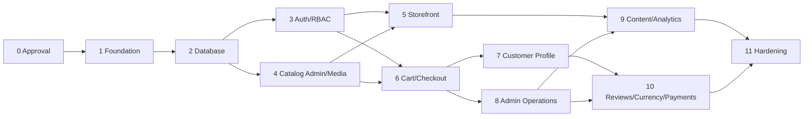

# White Shop — փուլային implementation plan

**Կարգավիճակ.** Active — Phase 2 schema migrated; seed/auth next
**Scope model.** Vertical slices after foundation
**Վերջին թարմացում.** 2026-07-18

## 1. Delivery principles

- Յուրաքանչյուր phase ունի database → domain/application → UI → tests → docs ամբողջական slice։
- Critical invariants-ը foundation-ում են, feature UI-ից առաջ։
- Production deployment/migration չի կատարվում առանց explicit approval-ի։
- Phase-ը չի փակվում միայն screen-ի տեսքով. persistence, permissions, states, translations և tests-ը նույն scope-ի մաս են։
- Exact estimates-ը տրվում են team size, design readiness և open decisions-ի approval-ից հետո։

## 2. Approval phase — Phase 0

### Scope

- Հաստատել `BRIEF.md`, `TECH_CARD.md`, architecture և P0/P1 boundary։
- Լուծել կամ milestone owner տալ `DECISIONS.md` open items-ին։
- Ընտրել hosting/runtime/regions, session/ID strategies և design source։
- Սահմանել tax/order/refund/legal/retention policies։

### Exit criteria

- [x] TECH_CARD status-ը `հաստատված` է։
- [x] Բոլոր blocking open decisions-ը resolved են (non-blocking OPEN-* defaults documented)։
- [x] Product owner/tech lead-ը հաստատել են implementation sequence-ը։

## 3. Foundation — Phase 1

### Deliverables

- Next.js App Router + TypeScript strict + pnpm scaffold։
- Tailwind/shadcn tokens, locale routing/dictionaries, base layouts/states։
- ESLint/Prettier/Vitest/RTL/Playwright և CI baseline։
- Environment validation և `.env.example` contract։
- Drizzle/Neon setup, migration workflow, base ID/timestamp/money conventions։
- Redis/R2/email/payment/exchange-rate interfaces և server-only config boundaries։
- Structured logging/correlation/error result primitives։

### Exit criteria

- Fresh install/build/typecheck/lint/unit smoke pass։
- Local/test database migration pass։
- Locale routes և client/server boundary tests pass։

## 4. Database foundation — Phase 2

### Deliverables

- Canonical 25-table migration՝ ըստ `03-DATA-MODEL.md` exact inventory-ի։
- Identity schema՝ users/sessions/addresses, իսկ verification/reset tokens՝ Redis TTL/atomic consume contract-ով։
- Catalog/content entities՝ validated translation JSONB + locale slug expression indexes։
- Unified promotions, embedded order address/idempotency snapshots, order events, audit և outbox schema։
- Indexes/checks/FK delete policies և idempotent seed։
- Repository/query conventions և transaction helpers։

### Exit criteria

- Fresh + incremental migrations pass։
- Schema inventory assertion-ը հաստատում է ճիշտ 25 application table։
- Constraints/concurrency integration tests pass։
- Seed-ը կրկնակի run-ից հետո duplicate չի ստեղծում։

## 5. Identity and authorization — Phase 3

### Deliverables

- Registration/login/logout, email verification, forgot/reset, password change։
- Argon2id, database sessions, rate limiting, generic errors։
- Server-side Customer/Admin policies, ownership guards, suspension/last-admin controls։
- Auth/profile shell translations և accessible forms/states։
- Guest cart token foundation և login merge hook։

### Exit criteria

- Auth/profile RBAC/IDOR/security integration tests pass։
- Critical auth Playwright journey pass։

## 6. Catalog admin + media — Phase 4

### Deliverables

- R2 upload intent/finalize/media lifecycle։
- Admin categories hierarchy և product CRUD/publish/archive։
- Multilingual translations/slugs/SEO/media sorting/primary image։
- Inventory adjustment + movements, featured/upcoming/badge fields։
- Admin table/drawer primitives և audit logs։

### Exit criteria

- Admin product/category/media E2E pass։
- Slug/SKU/cycle/stock/media negative tests pass։
- Public cache invalidation contracts verified։

## 7. Storefront catalog — Phase 5

### Deliverables

- Header/footer/mobile nav, locale/currency controls և policy route shells։
- Home hero/featured/about/CTA։
- Product list search/filter/sort/page URL contract։
- Product detail gallery/quantity/related products։
- Dynamic metadata, canonical/hreflang, sitemap/robots և Product/Breadcrumb JSON-LD։

### Exit criteria

- Browse/filter/product/locale E2E pass mobile և desktop-ում։
- SEO/a11y/performance baseline verified։

## 8. Cart and checkout — Phase 6

### Deliverables

- Guest/customer durable carts և idempotent merge։
- Delivery matcher/rules admin։
- Address/contact checkout steps և server order calculator։
- COD payment adapter, idempotent transactional order creation, stock decrement/movements/cart clear։
- Confirmation page և order email event։

### Exit criteria

- Tampered totals, duplicate submit, stock/coupon concurrency և rollback tests pass։
- Guest և authenticated COD checkout E2E pass։
- Order snapshots manually/automatically verified։

## 9. Customer self-service — Phase 7

### Deliverables

- Dashboard metrics/recent orders։
- Orders list/detail drawer։
- Personal information, addresses/defaults, password change։
- Delete/anonymize account ըստ approved retention policy։
- Wishlist և cart count/header integration։

### Exit criteria

- Ownership/IDOR/default address/account lifecycle tests pass։
- Customer profile/order E2E pass keyboard/mobile։

## 10. Admin commerce operations — Phase 8

### Deliverables

- Admin dashboard metrics/date comparison։
- Orders filters/detail/history/notes/bulk eligible transitions/archive։
- Users filter/detail/role/status/orders/last-admin guard։
- Unified promotions model-ի coupon և automatic product/category admin surfaces + stacking settings։
- Revenue-generating status configuration։

### Exit criteria

- Order/payment transition, audit, promotion concurrency tests pass։
- Admin order status և promotion E2E pass։

## 11. Content, communication and analytics — Phase 9

### Deliverables

- Hero CMS reorder/publish։
- Contact form spam controls + Messages inbox։
- Blog CMS/public routes, sanitizer, BlogPosting SEO։
- Analytics dashboard/date comparison/cache/CSV։
- Store settings/branding/social/maintenance mode։

### Exit criteria

- XSS/CSV/rate-limit/cache invalidation tests pass։
- Blog/contact/analytics representative E2E pass։

## 12. Reviews, currency and optional online payments — Phase 10

### Deliverables

- Verified-purchase reviews, aggregates և moderation։
- Exchange-rate provider/cache/fallback և order rate snapshot hardening։
- Approved online payment adapter(s), webhook idempotency, payment transitions և provider sandbox tests՝ եթե launch scope-ում են։

### Exit criteria

- Review eligibility/moderation E2E pass։
- Currency rounding/staleness/snapshot tests pass։
- Payment signature/replay/amount/currency/sandbox tests pass, եթե կիրառելի է։

## 13. Hardening and release readiness — Phase 11

### Deliverables

- Full regression, cross-browser/responsive/accessibility review։
- Query plans, load/performance/CWV/bundle/image optimization։
- CSP/security headers/WAF/config և security negative suite։
- Backup/restore, migration, rollback/incident/provider runbooks։
- Legal copy, retention, monitoring/alerts, production env inventory։
- README/setup/operations docs և final traceability review։

### Exit criteria

- `07-TESTING-AND-QUALITY.md` release Definition of Done complete։
- Production deploy checklist պատրաստ է։ Deployment-ը դեռ պահանջում է explicit authorization։

## 14. Dependency map

Phases-ի ներսում անվտանգ parallel work հնարավոր է միայն schema/contracts հաստատումից և non-overlapping module ownership-ից հետո։

## 15. Milestone reporting template

Յուրաքանչյուր phase-ի ավարտին `PROGRESS.md`-ում գրել՝

- Scope/requirement IDs
- Created/changed files
- Migration names և apply status
- Commands/tests run + exact result
- Manual verification viewports/flows
- Remaining risks/open decisions
- Next authorized phase

## 16. Scope change rules

- New feature-ը չի մտնում ընթացիկ phase առանց impact analysis-ի։
- Database/public route/role/money/checkout behavior change-ը պահանջում է affected specs update և անհրաժեշտ ADR։
- Deferred capability-ն launch scope տեղափոխելիս թարմացվում են BRIEF priorities, TECH_CARD, data model, tests և timeline։
